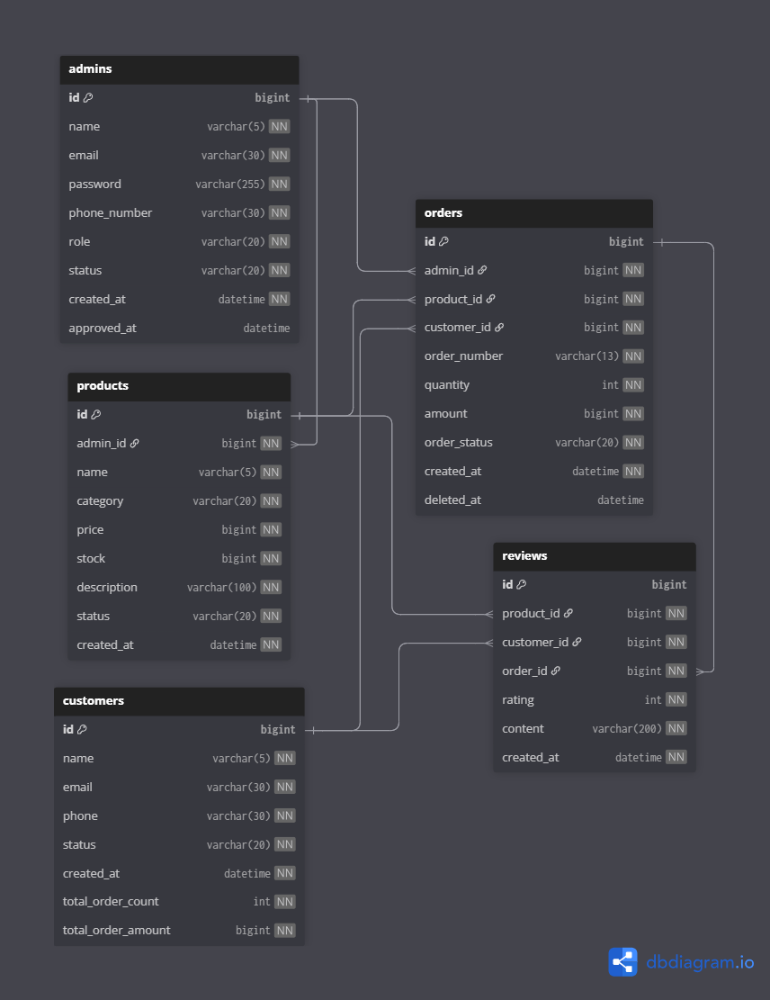

# 고객 및 상품 관리 시스템 프로젝트 by 포스트맨

## 목차

---

1. [프로젝트를 소개합니다!](#프로젝트-소개)
2. [프로젝트 설계](#ERD--API)
3. [프로젝트 자세히 알아보기?](#프로젝트-기능)
4. [프로젝트를 만든 사람들](#팀-소개)

***

# 프로젝트 소개

---

### 프로젝트 구성 요소

* admin 관리자
* customer 고객
* product 상품
* order 주문
* review 리뷰

### 프로젝트 운영 및 체계

고객, 상품, 주문, 리뷰 정보를 체계적으로 관리할 수 있어요.
* **고객 관리**: 사용자 프로필 및 활동 내역 관리
* **상품 관리**: 상품 등록, 수정 및 재고 추적
* **주문 관리**: 실시간 주문 현황 및 배송 상태 파약
* **리뷰 관리**: 고객 피드백 수집 및 평점 분석

관리자간의 역할과 권한을 나누어 효율적으로 관리할 수 있어요.
* **효율적인 운영**: 관리자별 직무에 맞는 접근 권한을 설정하여 업무 효율 증가

  

[목차로 돌아가기](#목차)

***

# ERD & API

---

### ERD 설계도

### API 설계

[API 명세서 확인하기](https://documenter.getpostman.com/view/50332844/2sBXVig9e7)

  

[목차로 돌아가기](#목차)

***

# 프로젝트 기능

---

- **관리자**
  - 관리자 회원가입 (가입 시 상태 : 승인대기)
  - 관리자 로그인 (활성 상태만 로그인 가능)
  - 관리자 로그아웃
  - 관리자 조회
    - 관리자들 목록 조회
    - 특정 관리자 조회
  - 관리자 정보, 역할, 상태 수정 (접근 권한: 슈퍼관리자)
  - 관리자 삭제 (접근 권한: 슈퍼관리자)
  - 로그인한 본인의 관리자 정보 조회 및 수정

- **고객**
  - 고객 조회
    - 고객들 목록 조회
    - 특정 고객 조회
  - 고객 정보 및 상태 수정 (접근 제한: CS 관리자)
  - 고객 삭제 (접근 제한: CS 관리자)

- **상품**
  - 상품 등록
  - 상품 조회
    - 상품들 목록 조회
    - 특정 상품 조회
  - 상품 정보, 재고, 상태 수정 (접근 제한: CS 관리자)
  - 상품 삭제 (접근 제한: CS 관리자)

- **주문**
  - CS 주문 등록 (접근 제한: 운영 관리자)
  - 주문 조회
    - 주문들 목록 조회
    - 특정 주문 조회
  - 주문 상태 수정
  - 주문 취소

- **리뷰**
  - 리뷰 조회
    - 리뷰들 목록 조회
    - 특정 리뷰 조회
  - 리뷰 삭제

  

[목차로 돌아가기](#목차)

***

# 팀 소개

---

### 포스트맨

| 이름  | Github                                        | Blog                                             |
|-----|-----------------------------------------------|--------------------------------------------------|
| 곽현민 | [prAha1030](https://github.com/prAha1030)     | [prAha1030](https://velog.io/@zkolonm28/posts)   |
| 김수민 | [soomin0209](https://github.com/soomin0209/)  | [soomin0209](https://velog.io/@soomin0209/posts) |
| 이준석 | [Perfect-Bee](https://github.com/Perfect-Bee) | [parslime](https://velog.io/@parslime/posts)     |
| 장지혁 | [dev-hyuck](https://github.com/dev-hyuck)     | [devtest1](https://devtest1.tistory.com/)        |

  

[목차로 돌아가기](#목차)